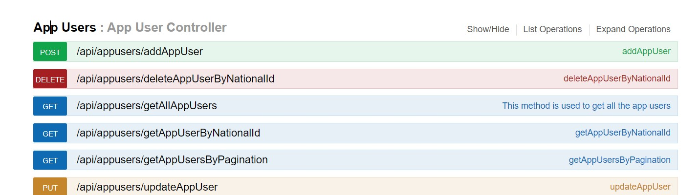
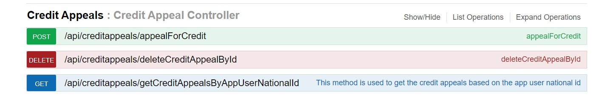
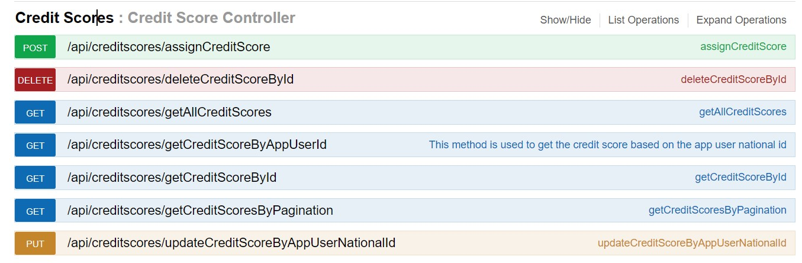

# creditComputator
Credit calculator service, final project

# Used Techonology: 
## Database
### PostgreSql

## Orm 
### Hibernate and Jpa

## Validation 
### Spring Validation

## Documentation Tool
### Swagger UI

## Mapper Tool
### ModelMapper

### 1-When User added then Credit Score Service go and National Id and credit Score adding then Credit Appeal Service go and with national id  you can learning  your credit result .your  credit result sended to sms your phone number
### 2-With Code first method created database tables 
### 3-My Unit Tests is Error.I got an error in unit tests at the last minute. 

# AppUser Endpoints

# CreditAppeals

# CreditScore Endpoints

